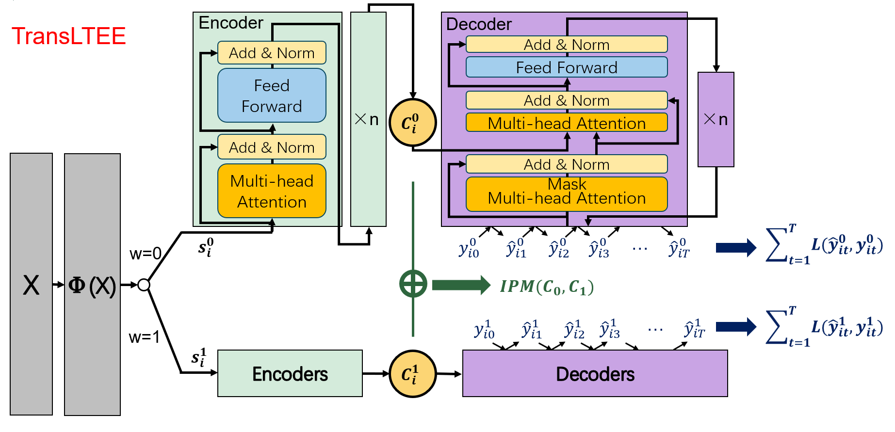

# TransLTEE

Reproducible TensorFlow implementation accompanying
**Short-term and Long-term Causal Effect Estimation with Double-head
Transformer** ([IEEE Xplore](https://ieeexplore.ieee.org/document/10475752)).



## What is implemented

- A shared context projection followed by **independent control and treatment
  Transformer heads**.
- Autoregressive, causally masked outcome decoding with positional embeddings.
- Mini-batch Sinkhorn approximation of the Wasserstein-1 balancing penalty.
- Deterministic, treatment-stratified **70/20/10** train/validation/test splits.
- IHDP and News experiments across all ten committed semi-synthetic
  realizations.
- Factual MAE/RMSE, ATE MAE/RMSE, and short-/long-term causal-effect sign
  accuracy.
- Machine-readable metrics, predictions, and model weights under `results/`.

The implementation always preserves the original sample order. Predictions
from the two heads are selected with a treatment mask rather than concatenating
control and treated samples, preventing labels and representations from being
misaligned.

## Installation

Python 3.11 is recommended.

```bash
python3.11 -m venv .venv
source .venv/bin/activate
pip install -r requirements.txt
```

Conda users can instead run:

```bash
conda env create -f environment.yml
conda activate transltee
```

## Run

One IHDP realization with the paper's reported optimizer settings:

```bash
python -m TransLTEE.main \
  --dataset ihdp \
  --repetition 1 \
  --epochs 50 \
  --batch-size 64 \
  --learning-rate 0.001
```

Run all ten realizations of both datasets:

```bash
python -m TransLTEE.main \
  --dataset both \
  --repetitions 10 \
  --epochs 50 \
  --batch-size 64 \
  --learning-rate 0.001
```

Fast CPU smoke test:

```bash
python -m TransLTEE.main \
  --dataset ihdp \
  --epochs 1 \
  --sequence-length 8 \
  --history-length 4 \
  --max-samples 128 \
  --d-model 16 \
  --num-heads 2 \
  --dff 32
```

Each run writes:

```text
results/<dataset>_rep<repetition>_seed<seed>/
├── metrics.json
├── model.weights.h5
└── predictions.npz
```

`results/summary.json` also reports the mean and standard deviation of every
scalar metric across the requested realizations, grouped by dataset.

## Metrics

- `factual_mae` and `factual_rmse` compare autoregressive factual predictions
  with observed factual outcomes in the test split.
- `ate_mae` and `ate_rmse` compare the predicted and synthetic ground-truth ATE
  sequences.
- The paper names Causal Effect Accuracy (CEA) but does not provide its
  equation. This repository reports the explicit, reproducible quantity
  `causal_effect_sign_accuracy`: the percentage of timesteps at which the
  predicted and ground-truth ATE signs agree. It is split at
  `--history-length` into short- and long-term values.

## Data

See [data/README.md](data/README.md) for the exact file contract and
provenance. In brief:

- IHDP contains 747 units and 25 context features.
- News contains 5,000 news documents represented by 3,477 word-count
  features.
- Each `Series_y_*.txt` file stores treatment followed by 100 factual
  outcomes.
- Each `Series_groundtruth_*.txt` file stores the 100-step synthetic ATE.

The News label files end in `.csv.y` because that is the upstream benchmark's
historical filename. They contain numeric CSV data, **not Yacc source code**.
The repository's `.gitattributes` excludes all datasets from GitHub language
statistics.

## Regenerate longitudinal outcomes

The committed sequences are retained as historical experiment snapshots.
Regeneration is now deterministic and writes two-dimensional text arrays:

```bash
python data_generateIHDP.py --repetitions 10 --seed 2023
python data_generate.py --repetitions 10 --seed 2023
```

Regenerating replaces the corresponding `Series_*.txt` files. Use a clean
working tree or a separate data directory when comparing generation schemes.

## Reproducibility note

The original public `main` branch did not contain the complete evaluation
pipeline used to produce the prose values in the paper. This revision makes the
model, data flow, split, metrics, and randomness explicit. It does not claim
that newly trained models will numerically reproduce undocumented historical
checkpoints.

## Tests

```bash
pip install -r requirements-dev.txt
pytest
```
